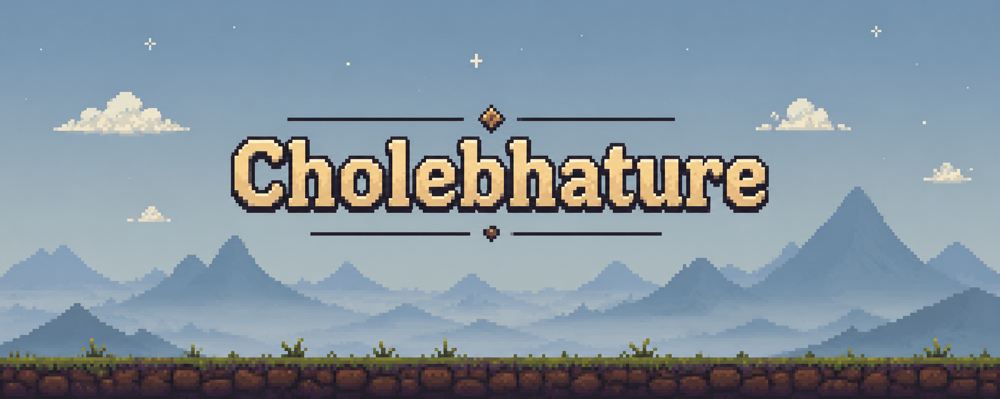

# AADITYA RAJ

### GAME DEVELOPER · PROGRAMMER · BUILDER

**I make games, break systems, and turn weird ideas into playable mechanics.**

---

## 🧠 About

Computer Science Engineering student focused on **gameplay programming and game development**.

I enjoy building mechanics that make players stop and think:

`World Switching` · `Time Manipulation` · `Physics` · `Procedural Systems` · `Game Feel`

---

## 🛠️ Arsenal

---

## 🎮 Featured Projects

### 🚗 Drift It
**Pixel-art top-down racing · WIP**

> No brakes. No second chances.

Drifting, jumping, water shaders and a night-time environment — built around chaotic but controlled driving.

**Stack:** Unity · C# · Shader Graph · Pixel Art

---

### 🌙 Nightmare — The Fairy Tale
**Pixel-art platformer · Completed**

A platformer built around **switching between two realities**, changing the world itself to overcome obstacles and enemies.

**Features:** World Switching · Enemy AI · Puzzle Mechanics · Pixel Art

---

## ⚡ Currently

**Building:** Drift It  
**Learning:** Advanced Unity · Shaders · Optimization · Procedural Generation  
**Exploring:** 3D Game Development · Game Physics · Design Patterns

---

## 📊 GitHub

---

### `while (alive) { build(); learn(); repeat(); }`

**Learn → Build → Break → Improve → Repeat.**

